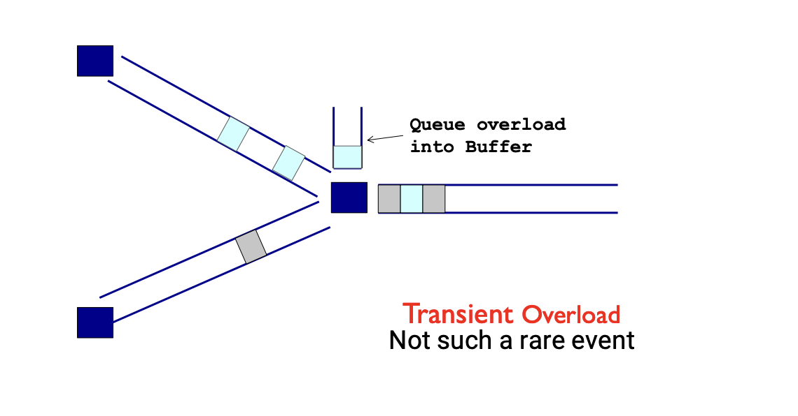
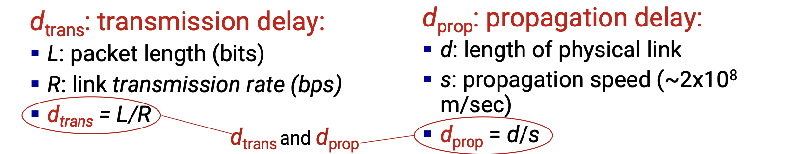
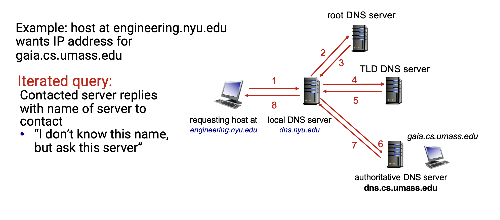
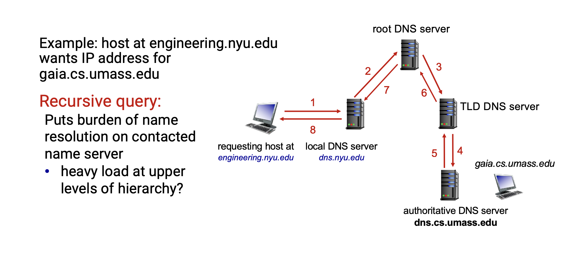

# COMP3331 Computer Networks & Applications

## Introduction to Networks

### The Internet
- Billions of connected computing devices
- Hosts = end systems
- Running network apps at the Internet's edge
- Packet switches: forward packets (chunks of data) - Routers, switches
- Coomuincation links - Fiber, copper, radio, satellite
- Netowrks - collection of devices, routers, links managed by an organisation

### Protocols
- Protocols define the format, order of messages sent and receieved among network entities and actions taken on message transmission, receipt.

3 main things:
- Format of message
- Order of message
- action taken on message

### Network Edge

- Network Edge
    - Hosts: client and servers
    - Servers often reside in data centres

- Access networks, physical media:
    - Wired links
    - Wireless links

- Network core:
    - Interconnected routers
    - Network of networks

#### Access Networks: digital subscriber line (DSL)

Use existing telephone line to central office DSLAM
- data over DSL phone line goes to internet
- voice over DSL phone line goes to telephone net

Different data rates for upload and download (ADSL)
- 24-52 Mbps dedicated downsream transmission rate
- 3.5-16 Mbps dedicated upstream transmission rate

Key definitions:
- ADSL, or Asymmetric Digital Subscriber Line, is an older type of broadband internet connection that uses existing copper phone lines to provide internet access
- Downstream transmission is the process of energy or data flowing from the source or provider to the end-user or customer, such as downloading files, receiving TV channels, or distributing refined fuel to consumers. Upstream transmission is the opposite, where data or products are sent from the end-user to the provider, like uploading files, sending emails, requesting information, or extracting raw materials from the ground

#### Access Networks: cable-based access

- frequency division multiplexing (FDM): different channels transmitted in different freauency bands

- HFC: hybrid fiber coax
    - assymetric: up to 40 Mbps - 1.2Gbps downstream transmission rate, 30-100 Mbps upstream transmission rate
- network of cable, fiber attaches homes to ISP router
    - homes share access network to cable headend
- FTTP/FTTB/FTTC
    - fully optical fiber path all the way to the building
    - e.g NVN
    - ~30Mbps to 1Gbps

#### Access Networks: Wireless networks

Wireless local area networks (WLANs)
- Typically within or around building (~100 ft)
- 802.11b/g/n
- WIFI 5/6/7

Wide-area cellular access networks
- provided by mobile, cellular network operator
- 4G/5G cellular networks

## Network core: packet/circuit switching, internet structure

Network Core: mesh of interconnnected routers

packet swithcing: hosts break application-layer messages into packets
    - forward packets from one router to the next, across links on path from source to destination
    - each packet transmitted at full link capacity
    - is used in the internet

circuit switching: an alternative used in legacy telephone networks which was considered during the design of the internet

#### Circuit Switching: FDM and TDM

Frequency Division Multiplexing (FDM)
- optical, electromagnetic frequencies divided into (narrow) freauency bands
- each call alloczted its own brand, can transmit at max rate of that narrow band

Time Division Multiplexing (TDM)
- time divided into slots
- each call allocated periodic slot(s), can transmit at maximum rate of (wider) frequency band but only during its time slot(s)

#### Timing in Circuit Switching

#### Why Circuit Switching is not feasible
- Inefficient
    - cannot be used or shared in periods of silence
- Fixed data rate
- connection state maintenance
    - requires per communicstion state - expensive
    - not scalable

## Packet Switching

- Data is sent as chunks of formatted bits (Packets)
- Packets consist of a "header" and "payload"
    - payload is the data being carried
    - header holds instructions to the network for how to handle packet (like an API)
- Switches/routers "forward" packets based on their headers
- Each packet travels independently
    - no notion of packets belonging to a "circuit"
- No link resources are reserved. Instead, packet switching leverages statistical multiplexing

#### Timing in Packet Switching

- "cut through" switch - switch starts transmission as soon as it has processed the header
- "store and forward" switch - switch processes/forwards a packet after it has received it entirely

#### Statistical Multiplexing: pipe view

No Overload

Transient Overload

Persistent Overload

#### Internet Structure

- tier 1 commercial ISPs: national & international coverage
- content provider networks: private network that connects its data centers to Internet, often bypassing tier-1 regional ISPs

## Performance: loss, delay, throughput

### How do packet loss and delay occur?
Packet queue in router buffers
- packets queu, wait for turn
- arrival rate to link (temporarily) exceeds output link capacity: packet loss

### Packet Delay: Four Sources

### Queuing Delay

- Every second: aL bits arrive to queue
- Every second: R bits leave the router
- aL/R is called traffic intensity

### Queuing Delay: Typical behaviour

### "Real" Internet delays and routes
- traceroute program: provides delay measurement from source to router along end-end Internet path towards destination. For all i:
    - sends three packets that will reach router i on path towards destination (with time-to-live field value of i)
    - router i will return packets to sender
    - sender measures time interval between transmission and reply

### Throughput
- Throughput rate (bits/time unit) at which bits are being sent from sender to receiever
    - instantaneous: rate at given point in time
    - average: rate over longer period of time

## Protocols layers, service models

### Internet Protocol Stack
- Application: supporting network applications
    - FTP, SMTP, HTTP, Skype
- Transport: process-process data transfer
    - TCP, UDP
- Network: routing of datagrams from source to destination
    - IP, routing protocols
- Link: data transfer between neighbouring network elements
    - Ethernet, 802.111 (wifi)
- Physical: "bits" on wire

### Three Observations 
Each layer:
- Depends on layer below
- Supports layer above
- Independent of others

Multiple versions in layer
- Interfaces differ somewhat
- Components pick which lower-level protocol to use

But only one IP layer
- Unifying protocol

### Cons to Layering
- Layer N may duplicate lower-level functionality
    - e.g error recovery to retransmit lost data
- Information hiding may hurt performance
    - e.g packet loss due to corruption vs congestion
- Headers start to get really big
    - e.g typically TCP + IP + Ethernet headers
- Layer violations when the gains too great to resist
    - e.g NAT
- Layer violations when entwork doesn't trust ends
    - e.g Firewalls

### Distributing layers across networks
- need to implement across machines
    - Hosts
    - Routers 
    - Switches

Hosts:
- have applications that generate data/messages that are eventually put on wire
- at receiever host bits arrive on wire, must make it up to application
- therefore all layers must exist on host!

Routers:
- Bits arrive on wire
    - Physical layer necessary
- Packets must be delivered to next-hop
    - datalink layer necessary
- Routers participate in global delivery
    - network layer necessary
- routers don't support reliable delivery
    - transport layer not supported

### Logical Communications

## Application Layer

### Internet Transport Protocol Services
TCP Service:
- reliable transport between sending and receiving process
- flow control: sender won't overwhelm receiever
- congestion control: throttle sender when network overloaded
- does not provide: timing, minimum throughput guarantee, security
- connection-oriented: setup required between client and server processes

UDP Service:
- unreliable data transfer between sending and receiving process
- does not provide: reliability, flow control, congestion control, timing, throughput guarantee, security or connection setup.

### Web and HTTP
- Web page consists of objects, each of which can be stored on different web servers
- object can be HTML file, JPEG image, Java applet, audio file
- web page consists of base HTML-file which includes several referenced objects, each addressable by a URL

### Uniform Resource Locator (URL)
`protocol://host-name[:port]/directory-path/resource`
- protocol: http, gtp, https, smtp, etc
- hostname: DNS name, IP address
- port: defaults to protocol's standard port, e.g http: 80, https: 443
- directory path: heirarchical, reflecting file system
- resource: identifies the desired resource

### HTTP Overview
HTTP: hypertext transfer protocol
- Web's application layer protocol
- client/server model:
    - client: browser that requests, receives and "displays" web objects
    - server: web server sends objects in response to requests
HTTP uses TCP:
- client intitiates TCP connection to server, port 80
- server accepts TCP connection from client
- HTTP messages (application-layer protocol messages) exchanged between browser (HTTP client) and Web Server (HTTP Server)
- TCP connection closed
HTTP is "stateless"
- server maintains no information about past client requests

### HTTP Request Message
- two types of HTTP requests: request, response
- HTTP request message:
    - ASCII (human-readable format)

### HTTP Request MEssage: General Format

### Other HTTP Request Messages:
POST method:
- web page often includes form input
- user input sent from client ot server in entity body of HTTP POST request message
- user input sent from client ot server in entitiy body of HTTP POST request
GET (in-URL) method:
- include user data in URL field of HTTP GET request message
HEAD method:
- requests headers (only) that would be returned if specified URL were requested with an HTTP 
PUT method:
- uploads new file (object) to server
- completely replaces file that exists at specified URL with content in entity body of PUT HTTP request message

### HTTP Response Message

### HTTP Response Status Codes
- 200 OK
    - request succeeded, requested object later in this message
- 301 Moved Permenantly
    - requested object moved, new location specified later in this message
- 400 Bad Request
    - request msg not understood by server
- 404 Not Found
    - requested document not found on this server
- 505 HTTP Version not Supported

### HTTP is all text
- Makes the protocol simple
    - Easy to delineate messages (\r\n)
    - (relatively) human-readable
    - No issues about encoding or formatting data
    - Variable length data
- Not the most efficient
    - Many protocols use binary fields
        - Sending "12345678" as a string of 8 bytes
        - As an integer 12345678 needs only 8 bytes
    - Headers may come in any order
    - Requires string parsing/processing

### Maintaing User State: Cookies
- Websites and client browsers use cookies to maintain some state between transactions

four components:
1. cookie header line of HTTP response message
2. cookie header line in next HTTP request message
3. cookie file kept on user's host, managed by user's browser
4. back-end database at website

### HTTP Cookies: Comments
- What cookies can be used for:
    - authorisation
    - shopping carts
    - recommendations
    - user session state
- cookies and privacy:
    - cookies permit sites to learn a lot about you on their site
    - third part persistent cookies allow common identity to be tracked across multiple web sites

### Performance of HTTP
- Page Load Time (PLT) is an important metric
    - from click (or typing URL) until user sees page
    - Key measure of web performance

Depends on many factors, such as 
- page content/structure
- protocols involved
- Network bandwith and RTT

### Performance Goals
- User
    - fast downloads
    - high availability
- Content provider
    - happy users
    - cost effective infrastructure
- Network (secondary)
    - avoid overload

### How to improve PLT
- Reduce content size for transfer
    - smaller images, compression
- Change HTTP to make better yse of available bandwidth
    - Persistent connections and pipelining
- Change HTTP to avoid repeated transfers of the same content
    - Caching and web-proxies
- Move content closer to the client
    - CDNs

### Non-Peristance HTTP: Response Time
- RTT (definition): time for a small packet to travel from client to server and back
- HTTP Response Time: One RTT to initiate TCP connection (approximate 3 way handshake)
- one RTT for HTTP reauest and first few bytes of HTTP response to return
- File transmission time:
    - non persistance response time = 2RTT + file transmission time

### Non-Persistence HTTP: HTTP 1.0
- Non-Persistent: One TCP connection to fetch one web resource
    - Fairly poor PLT

2 scenarios
- Multiple TCP connections setups to the same server
- Sequential reauest/responses even when resources ar elocated on different servers

### Persistence HTTP: HTTP/1.1

#### Persistent HTTP
- Server leaves TCP connection open after sending response
    - subsequent HTTP messages between same client/server are setn over the same TCP connection
    - Allow TCP to learn more accurate RTT estimate
    - Allow TCP congestion window to increase 

#### Persistent without pipelining
- Client issues new request only when previours response has been receieved
    - one RTT for each referenced object

#### Persistent with pipelining
- Client sends requests as soon as it encounters a referenced object
    - as little as one RTT for all the referenced objects

### Improving HTTP Performance: Caching
- Goal: Satisfy client request without involving origin server
- User configures browser to point to a Web cache
- Browser sends all HTTP requests to cache
    - If object in cache: cache returns object to client
    - else cache requests object from origin server, caches receievd objct, then returns object to client

### HTTP & Caching: Conditional GET
- Goal: don't send object if cache has up-to-date cached version
    - no object transmission delay
    - lower link utilisation
- client: specify date of cached copy in HTTP request
    - If-modified-since: \<date>
- server: response contains no object if cached copy is up-to-date
    - HTTP/1.0 304 Not Modified

### Improving HTTP Performance: Replication
- Replicate popular web site across many machines
- Places content closer to clients
- Helps when content isn't cacheable

Problem:
- Want to direct client to particular replica
    - Balance load across server replicas
    - Pair clients with nearby servers
- Expensive

Common solution:
- DNS returns different addresses based on client's geo-location, server load, etc.

### Improving HTTP Performance: CDNs

- Caching and replication as a service
- Large-scale distributed storage infrastructure administered by one entitity
- Combination of (pull) caching and (push) replication
    - Pull: Direct result of clients' requests
    - Push: Expectation of high access rate

### What about HTTPS
- HTTP is insecure
- HTTP basic authentication: password sent using base64 encoding (can be readily converted to plaintext)
- HTTPS: HTTP over a connection encrypted by Transport Layer Security (TLS)
- Provides:
    - Authentication
    - Bidirectional encryption

### HTTP/2 (Google SPDY)
- Key Goal: decreased delay in multi-object HTTP requests

#### HTTP 1.1:
- Introduced multiple, pipelined GETS over single TCP connection
    - server responds in-order to GET requests
    - with FCFS, small object may have to wait for transmission (head of line (HOL) blocking) behind large objects
    - loss recovery (retransmitting lost TCP segments) stalls object transmission

### HTTP/2: mitigating HOL blocking
Increased flexibility at server in sending objects to client:
- methods, status codes, most header fields unchanged from HTTP 1.1
- transmission order of requested objecst based on client-specified object priority
- push unrequested objects to client (server push of resources)
- divide objects into frames, schedule frames to mitigate HOL blocking

### HTTP/3 
HTTP/3: runs on top of QUIC which replaces TCP as transport layer
- runs over QUIC, a transport layer buult on top of UDP
- designed to address latency, HOL blocking and mobile network challenges
- Benefits: faster page loads, smoother video streaming and better reliability on unstable networks

## Electronic mail - SMTP

### Email
Three major components:
- user agents
- mail servers
- simple mail transfer protocol: SMTP

User Agent:
- composing, editing, reading mail messages
- e.g Outlook, iPhone mail client
- outgoing, incoming messages stored on server

Mail Servers:
- mailbox contains incoming messages for user
- message queue of outgoing mail messages
- SMTP protocol between mail servers to send email messages
    - client: sending mail server
    - server: receiving mail server

### Email: RFC 5321
- Uses TCP to reliably transfer email message from client to server, port 25
- Direct transfer: sending server to receiving server
- Three phases of transfer:
    - handshaking
    - transfer of messages
    - closure
- Command/response interaction
    - commands: ASCII text
    - response: status code and phrase
- Messages must be in 7-bit ASCII

### SMTP: Closing Remarks
- SMTP: push
- SMTP: multiple objects sent in multipart message
- SMTP uses persistent connections
- SMTP requires message to be in 7-bit ASCII
- SMTP server uses CRLF.CRLF to determine end of message

### Mail Message Format
- SMTP: protocol for exchanging e-mail messages, defined in RFC 5321
- RFC 822 defines syntax for e-mail message itself

### Mail Access Protocol
- SMTP: delivery/storage of e-mail messages to receiver's server
- mail access protocol: retrieval from server
    - IMAP: Internet Mail Access Protocol [RFC 3501]: messages stored on server, IMAP provides retrieval, deletion, folders of stored messages on server
- HTTP: gmail, Hotmail, Yahoo, etc provides web-based interface on top of SMTP (to send), IMAP (or POP) to retrieve e-mail messages.

## Domain Name System (DNS)

### DNS: Services, Structure

#### DNS services:
- hostname to IP address translation
- host alisaing
    - canonical, alias names
- mail server aliasing
- load distribution
    - replicated Web servers: many IP addresses correspond to one name

### DNS: Goals
- No naming conflicts (uniqueness)
- Scalable
    - many names
    - (secondary) frequent updates
- Distributed, autonomous administration
    - Ability to update my own (domains') names
    - Don't have to track everybody's updates
- High available
- Lookups should be fast

### Hierarchical Namespace
- "Top Level Domains" are at the top
- Domains are sub-trees
    - E.g .edu, berkely.edu, eecs.berkeley.edu
- Name is leaf-to-root path
    - instr.eecs.berkely.edu
- Depth of tree is arbitrary (limit 128)
- Name collisions trivially avoided

### Hierarchical Administration

### DNS Root Name Servers
- Contact by name servers that can not resolve name
- ICANN (Internet Corporation for Assigned Names and Numbers) manages root DNS domain

### TLD and Authoratative DNS Servers

#### Top-Level Domain (TLD) servers:
- .com, .org, .edu and all top-level country domainss, e.g .cn, .uk, .au
- Network Solutions: authorative registry for .com, .net TLD
- Educause: .edu TLD

#### Authoratative DNS servers:
- organisation's own DNS server(s) providing authoratative hostname to IP mappings for organisations named hosts
- can be maintained by organisation or service provider

### DNS name resolution: iterated query

### DNS name resolution: recursive query

### Caching, updating DNS Records
- Once a name server learns mapping, it caches mapping
    - cache entries timeout (disappear) after some time (TTL)
    - TLD servers typucally cached in local name servers
        - root name servers not often visited
- Cached entries may be out-of-date
    - if name host changes IP address, may not be known Internet-wide until all TTLs expire
- Update/notify mechanisms proposed IETF standard
    - RFC 2136
- Negative caching (optional)
    - Remember things that don't work

### DNS Records
- DNS: distributed database storing resource records (RR)
    - RR format: (`name, value, type, ttl`)
- type=A
    - `name` is hostname
    - `value` is IP address
- type=NS
    - `name` is domain 
    - `value` is hostname of authoratative name server for this domain
- type=CNAME
    - `name` is alias name for some real name
    - `value` is canonical (real) name
- type=MX
    - `value` is the name of mailserver associated with `name`

### DNS protocol messages
- DNS query and reply messages, both have same format

## Peer to Peer (P2P) Architecture

### P2P
- a decentralized network model where individual participants, or "peers," act as both clients and servers, sharing resources and data directly with each other without a central authority

### File Distribution time: client-server
- server transmission: must sequentially send (upload) N file copies:
    - time to send one cpy: F/us
    - time to send N copies: NF/us
- client: each client must download file copy
- dmin = min client download rate
- slowest client download time: F/dmin

### File Distribution time: P2P
- server transmission: must upload at least one copy:
    - time to send one copy: F/us
- client: each client must download file copy
    - slowest client download time: F/dmin
- clients: as aggregate must download NF bits
    - max upload rate is us + Nui

### P2P File Distribution: BitTorrent
- file divided into 256KB chunks
- peers in torrent send/receive file chunks

- peer joining torrent:
    - has no chunks, but will accumulate them over time from other peers
    - registers with tracker to get list of peers, connects to subset of peers
- while downloading, peer uploads chunks to other peers
- peer may change peers with whom it exchange chunks
- churn: peers may come and go
- once peer has entire file, it may (selfishly) leave or (altruistically) remain in torrent

### BitTorrent: Requesting, Sending File Chunks
Requesting chunks:
- at any given time, different peers have different subsets of file chunks
- periodically, Alice asks each peer for list of chunks that they have
- Alice requests missing chunks from peers, rarest first

Sending chunks: tit-for-tat:
- Alice sends chunks to those four peers currently sending her chunks at highest rate
    - other peers are choked by Alice (do not receive chunks from her)
    - re-evaluate top 4 every 10 seconds
- every 30 seconds: randomly select another peer, starts sending chunks
    - optimistcally unchoke this peer
    - newly chosen peer may join top 4

### BitTorrent: Tit-for-Tat

## Content Distribution Networks (CDNs)

### Streaming multimedia: DASH
- DASH: Dynamic, Adaptive, Streaming over HTTP

server:
- divides video file into multiple chunks
- each chunk stored, encoded at different rates
- manifest file: provides URLs for different chunks

client:
- periodically measures server-to-client bandwidth
- consulting manifest, requests one chunk at a time
    - chooses maximum coding rate sustainable given current bandwidth
    - can choose different coding rates at different points in time

### CDNs
- store/serve multiple copies of videos at multiple geographically distributed sites
    - enter deep: push CDN servers deep into mant access networks
        - close to users
    - bring home: smaller number (10's) of larger clusters in POPs near access networks

# Transport Layer

## Transport Layer Services & Protocols
- Provide logical communication between application processes running on different hosts

- Transport protocols actions in end system
    - sender: breaks application messages into segments, passes to network layer
    - receiver: reassembles segments into messages, passes to application layer
- Two transport protocols available to Internet applications
    - TCP, UDP

## Two Principle Transport Layer Protocols
TCP: Transmission Control Protocol
- reliable, in-order delivery
- congestion control
- flow control
- connection setup

UDP: User Datagram Protocol
- unreliable, unordered delivery
- no frills extension of "best-effort" IP
- Services not available:
    - delay guarantees
    - bandwidth guarantees

## Multiplexing/demultiplexing

## How Demultiplexing Works
Host receives IP datagrams
- each datagram has source IP addresses, destination IP addresses
- each datagram carries one transport-layer segment
- each segment has source, destination port number

Host uses IP addresses & port numbers to direct segment to appropriate socket

## Connection oriented demulitplexing (TCP)
- TCP socket identified by 4-tuple:
    - source IP address
    - source port number
    - dest IP address
    - dest port number
- demux: receiver uses all four values (4-tuple) to direct segment to appropriate socket
- Server may support many simulatenous TCP sockets:
    - each socket identified by its own 4-tuple
    - each socket associated with a different connecting client

## Connectionless transport: UDP

### User Datagram Protocol (UDP) - RFC 768
connectionless:
- no handshaking between UDP sender, receiver
- each UDP segment handled independently of others

Why is there a UDP?
- no connection establishment 
- simple: no connection state at sender, receiver
- small header size
- no congestion control
    - UDP can blast away as fast as desired!
    - can function in the face of congestion

## User Datagram Protocol (UDP)
Applications that use UDP:
- streaming multimedia apps (loss tolerant, rate sensitive)
- DNS
- SNMP
- HTTP/3

If reliable transfer needed over UDP (e.g HTTP/3)
- add needed reliability at application layer
- add congestion control at application layer

## UDP segment header

## UDP checksum
Goal: detect errors (i.e flipped bits) in transmitted segment

## Internet Checksum
sender:
- treat contents of UDP segment as sequences of 16-bi9t integers
- checksum: addition (one's complement sum) of segment content
- checksum value put into UDP checksum field

receiver:
- compute checksum of received segment
- check if computed checksum equals checksum field value:
    - not equal - error detected
    - equal - no error detected. But maybe errors nonetheless

